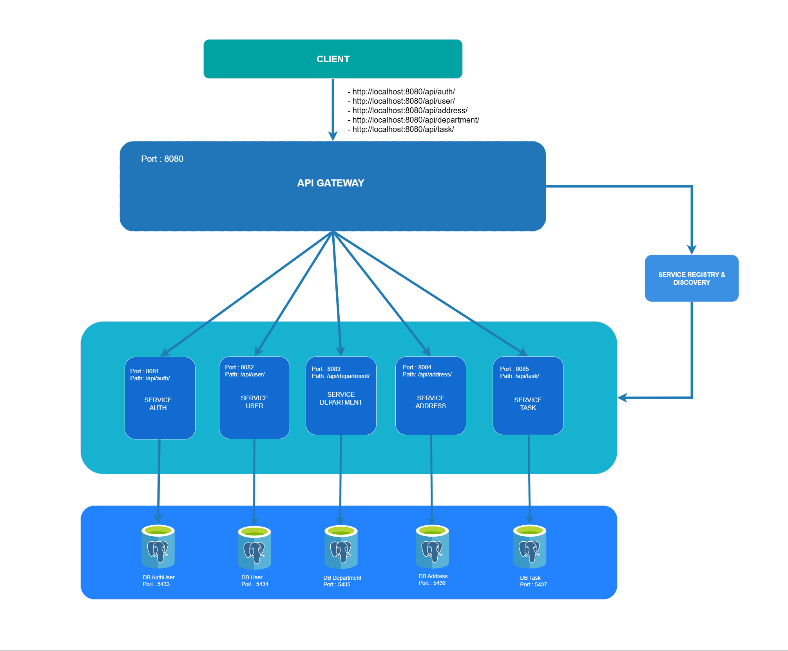

# Microservices Architecture: (Spring Boot + PostgreSQL + API Gateway + Eureka Server + JWT Authenticaton + Docker + Swagger)

This project is an implementation of a Microservices Architecture built using modern technologies such as Spring Boot, Spring Cloud, PostgreSQL, Docker, and more.

One of the key focuses of this architecture is security through authentication and authorization, implemented using JWT (JSON Web Token) via a dedicated service called auth-service.
Every incoming request is first validated through the API Gateway, ensuring that only authenticated and authorized requests are allowed to access internal services.

## Technologies Used
- Spring Boot (Web & WebFlux) – Core framework for building services
- Spring Security – Secures endpoints with JWT authentication
- PostgreSQL – Database used by each service as needed
- Spring Cloud Gateway – Handles routing and filtering of HTTP requests
- Eureka Server – Enables service registration and discovery
- Docker – Simplifies deployment of services
- Swagger / OpenAPI – Provides auto-generated API documentation


## Architecture Diagram
<p align="center">
  
</p>


## Microservices Overview

### api-gateway

Serves as the main entry point for all incoming requests to the system, with several key responsibilities:

- Routing: Forwards client requests to the appropriate microservice based on the request path.
- Security Filter (JWT Validation):
    - Validates the JWT Token on every incoming request.
    - Denies access if the token is invalid, expired, or missing.

  - Excludes specific paths from authentication to allow public access, such as:
      - /auth/signup
      - /auth/signin
      - /auth/refreshtoken

- CORS Configuration: Centralized configuration for handling Cross-Origin Resource Sharing (CORS) across services.

### eureka-server

A Service Registry where all services register themselves and discover each other dynamically.

- Main benefits:
  - Enables dynamic service discovery without the need for static configuration (e.g., hardcoded IPs or ports).
  - Simplifies horizontal scaling.
  - Improves overall system resilience and availability.

### auth-service

Handles all Authentication and Authorization operations, including:
- Register: Create new user accounts.
- Login: Verify user credentials and issue JWT tokens.
- Refresh Token: Generate new access tokens without requiring re-login.
- Logout: Invalidate or remove tokens (optional implementation).

### user-service

Manages user-related data, including:
- User profiles and personal information
- Updating user data
- Relationships with services like department-service and address-service

### department-service
Provides department-related data that is consumed by user-service to associate users with their respective departments.
- Responsible for creating, updating, and deleting department records
- Acts as a centralized data provider for department information
- user-service retrieves department details via REST communication

### address-service
Manages address information, which is retrieved by user-service and potentially other services.
- Provides CRUD operations for address records
- Serves as the main source of address data in the system
- user-service integrates with this service to store and fetch user address details

### task-service
Handles task management functionality, including:
- Creating and updating tasks
- Managing task status and progress
- Linking tasks to users
- Integrated with other services such as user-service


## Dependencies

### Api-Gateway        
- `spring-cloud-starter-gateway-server-webflux`  
- `spring-boot-starter-webflux`  
- `spring-cloud-starter-netflix-eureka-client`  
- `springdoc-openapi-starter-webflux-ui`  
- `spring-cloud-starter-loadbalancer`
- `spring-boot-starter-security`
- `jjwt-api`
- `jjwt-impl`
- `jjwt-jackson`

### Eureka Server
- `spring-boot-starter-web`  
- `spring-cloud-starter-netflix-eureka-server`  
- `spring-boot-starter-actuator`

### Service-Auth
- `spring-boot-starter-web`  
- `spring-boot-starter-data-jpa`
- `spring-boot-starter-security`
- `spring-boot-starter-webflux`
- `spring-cloud-starter-loadbalancer`
- `spring-cloud-starter-netflix-eureka-client`
- `springdoc-openapi-starter-webmvc-ui`
- `postgresql`  
- `lombok`  
- `jjwt-api`
- `jjwt-impl`
- `jjwt-jackson`


### Service-User
- `spring-boot-starter-web`  
- `spring-boot-starter-data-jpa`
- `spring-boot-starter-webflux`  
- `spring-cloud-starter-netflix-eureka-client`
- `spring-cloud-starter-loadbalancer`
- `springdoc-openapi-starter-webmvc-ui`
- `postgresql`  
- `lombok`  

### Service-Department
- `spring-boot-starter-web`  
- `spring-boot-starter-data-jpa`  
- `spring-cloud-starter-netflix-eureka-client`
- `springdoc-openapi-starter-webmvc-ui`
- `postgresql`  
- `lombok`  

### Service-Address
- `spring-boot-starter-web`  
- `spring-boot-starter-data-jpa`  
- `spring-cloud-starter-netflix-eureka-client`
- `springdoc-openapi-starter-webmvc-ui`
- `postgresql`  
- `lombok`  

### Service-Task
- `spring-boot-starter-web`  
- `spring-boot-starter-data-jpa`
- `spring-boot-starter-webflux`  
- `spring-cloud-starter-netflix-eureka-client`
- `spring-cloud-starter-loadbalancer`
- `springdoc-openapi-starter-webmvc-ui`
- `postgresql`  
- `lombok`  

## Database
Each service has its own separate PostgreSQL database:
- authdb
- userdb
- departmentdb
- addressdb
- taskdb


## Configuration


### api-gateway (application.yml)
```yaml
server:
  port: 8080

spring:
  application:
    name: api-gateway

  cloud:
    gateway:
      server:
        webflux:
          routes:
            - id: auth-service
              uri: lb://auth-service
              predicates:
                - Path=/api/auth/**
              filters:
                - RewritePath=/api/auth/(?<segment>.*), /api/auth/${segment}

            - id: user-service
              uri: lb://user-service
              predicates:
                - Path=/api/user/**
              filters:
                - RewritePath=/api/user/(?<segment>.*), /api/user/${segment}
            
            - id: department-service
              uri: lb://department-service
              predicates:
                - Path=/api/department/**
              filters:
                - RewritePath=/api/department/(?<segment>.*), /api/department/${segment}

            - id: address-service
              uri: lb://address-service
              predicates:
                - Path=/api/address/**
              filters:
                - RewritePath=/api/address/(?<segment>.*), /api/address/${segment}

            - id: task-service
              uri: lb://task-service
              predicates:
                - Path=/api/task/**
              filters:
                - RewritePath=/api/task/(?<segment>.*), /api/task/${segment}

springdoc:
  swagger-ui:
    urls:
      - url: /api/auth/v3/api-docs
        name: Auth Service

      - url: /api/user/v3/api-docs
        name: User Service

      - url: /api/department/v3/api-docs
        name: Department Service

      - url: /api/address/v3/api-docs
        name: Address Service

      - url: /api/task/v3/api-docs
        name: Task Service

logging:
  level:
    org.springframework.cloud.gateway: DEBUG


eureka:
  client:
    service-url:
      defaultZone: ${EUREKA_CLIENT_SERVICEURL_DEFAULTZONE:http://eurekaserver:8761/eureka/}
    register-with-eureka: true
    fetch-registry: true

```

### eureka-server (application.yml)

```yaml
server:
  port: 8761

spring:
  application:
    name: eureka-server

management:
  endpoints:
    web:
      exposure:
        include: health, info
  endpoint:
    health:
      show-details: always

logging:
  level:
    com.netflix.discovery: DEBUG

eureka:
  client:
    register-with-eureka: false
    fetch-registry: true

```

### auth-service (application.yml)

```yaml
server:
  port: 8081

spring:
  application:
    name: auth-service
  datasource:
    url: ${SPRING_DATASOURCE_URL}
    username: ${SPRING_DATASOURCE_USERNAME}
    password: ${SPRING_DATASOURCE_PASSWORD}
  jpa:
    hibernate:
      ddl-auto: update
    show-sql: true
    properties:
      hibernate:
        dialect: org.hibernate.dialect.PostgreSQLDialect

blackcode:
  app:
    jwtSecret: ${blackcode.app.jwtSecret}
    jwtExpirationMs: ${blackcode.app.jwtExpirationMs}
    jwtRefreshExpirationMs: ${blackcode.app.jwtRefreshExpirationMs}


springdoc:
  api-docs:
    path: /api/auth/v3/api-docs
  swagger-ui:
    path: /swagger-ui.html
    enabled: true

eureka:
  client:
    service-url:
      defaultZone: ${EUREKA_CLIENT_SERVICEURL_DEFAULTZONE:http://eurekaserver:8761/eureka/}
    register-with-eureka: true
    fetch-registry: true
```


### user-service (application.yml)

```yaml
server:
  port: 8082

spring:
  application:
    name: user-service
  datasource:
    url: ${SPRING_DATASOURCE_URL}
    username: ${SPRING_DATASOURCE_USERNAME}
    password: ${SPRING_DATASOURCE_PASSWORD}
  jpa:
    hibernate:
      ddl-auto: update
    show-sql: true
    properties:
      hibernate:
        dialect: org.hibernate.dialect.PostgreSQLDialect

springdoc:
  api-docs:
    path: /api/user/v3/api-docs
  swagger-ui:
    path: /swagger-ui.html
    enabled: true

eureka:
  client:
    service-url:
      defaultZone: ${EUREKA_CLIENT_SERVICEURL_DEFAULTZONE:http://eurekaserver:8761/eureka/}
    register-with-eureka: true
    fetch-registry: true

```

### department-service (application.yml)
```yaml
server:
  port: 8083

spring:
  application:
    name: department-service
  datasource:
    url: ${SPRING_DATASOURCE_URL}
    username: ${SPRING_DATASOURCE_USERNAME}
    password: ${SPRING_DATASOURCE_PASSWORD}
  jpa:
    hibernate:
      ddl-auto: update
    show-sql: true

springdoc:
  api-docs:
    path: /api/department/v3/api-docs
  swagger-ui:
    path: /swagger-ui.html
    enabled: true

eureka:
  client:
    service-url:
      defaultZone: ${EUREKA_CLIENT_SERVICEURL_DEFAULTZONE:http://eurekaserver:8761/eureka/}
    register-with-eureka: true
    fetch-registry: true
```

### address-service (application.yml)
```yaml
server:
  port: 8084

spring:
  application:
    name: address-service
  datasource:
    url: ${SPRING_DATASOURCE_URL}
    username: ${SPRING_DATASOURCE_USERNAME}
    password: ${SPRING_DATASOURCE_PASSWORD}
  jpa:
    hibernate:
      ddl-auto: update
    show-sql: true

springdoc:
  api-docs:
    path: /api/address/v3/api-docs
  swagger-ui:
    path: /swagger-ui.html
    enabled: true

eureka:
  client:
    service-url:
      defaultZone: ${EUREKA_CLIENT_SERVICEURL_DEFAULTZONE:http://eurekaserver:8761/eureka/}
    register-with-eureka: true
    fetch-registry: true
```

### task-service (application.yml)
```yaml
server:
  port: 8085

spring:
  application:
    name: task-service
  datasource:
    url: ${SPRING_DATASOURCE_URL}
    username: ${SPRING_DATASOURCE_USERNAME}
    password: ${SPRING_DATASOURCE_PASSWORD}
  jpa:
    hibernate:
      ddl-auto: update
    show-sql: true

springdoc:
  api-docs:
    path: /api/task/v3/api-docs
  swagger-ui:
    path: /swagger-ui.html
    enabled: true

eureka:
  client:
    service-url:
      defaultZone: ${EUREKA_CLIENT_SERVICEURL_DEFAULTZONE:http://eurekaserver:8761/eureka/}
    register-with-eureka: true
    fetch-registry: true

```


### task-service (application.yml)
```yaml

```

## Docker & Deployment

This project is fully integrated with:

- Docker for containerization
- Automated health checks and restart policies
- To run all services together:


## Run Project
```
docker-compose up --build
```

## Stop Project
```
docker-compose down
```


## API Documentation (Swagger UI)

The API documentation using Swagger UI can be accessed at the following base URL:
```
http://localhost:8080/swagger-ui/index.html
```

## API Endpoints

All requests are sent through the API Gateway at:
```
http://localhost:8080
```

### Service: Auth 

Base URL: `http://localhost:8080/api/auth/signup`

| Method | Endpoint                 | Description         |
|--------|--------------------------|---------------------|
| POST   | `/signup`                | Registration User   |
| POST   | `/signin`                | Login User          |
| POST   | `/refreshtoken`          | Refresh Token       |
| POST   | `/signout`               | Logout User         |


### Service: Address 

Base URL: `http://localhost:8080/api/address`

| Method | Endpoint                 | Description         |
|--------|--------------------------|---------------------|
| GET    | `/getAllAddress`         | Get all addresses   |
| GET    | `/getAddressById/{id}`   | Get address by ID   |
| POST   | `/addAddress`            | Create new address  |
| PUT    | `/updateAddress/{id}`    | Update address      |
| DELETE | `/deleteAddress/{id}`    | Delete address      |


### Service: Department 

Base URL: `http://localhost:8080/api/department`

| Method | Endpoint                    | Description          |
|--------|-----------------------------|----------------------|
| GET    | `/getAllDepartment`         | Get all departments  |
| GET    | `/getDepartmentById/{id}`   | Get department by ID |
| POST   | `/addDepartment`            | Create new department|
| PUT    | `/updateDepartment/{id}`    | Update department    |
| DELETE | `/deleteDepartment/{id}`    | Delete department    |


### Service: User

Base URL: `http://localhost:8080/api/user`

| Method | Endpoint              | Description      |
|--------|-----------------------|------------------|
| GET    | `/getAllUser`         | Get all users    |
| GET    | `/getUserById/{id}`   | Get user by ID   |
| PUT    | `/updateUser/{id}`    | Update user      |
| DELETE | `/deleteUser/{id}`    | Delete user      |


### Service: Task

Base URL: `http://localhost:8080/api/task`

| Method | Endpoint              | Description      |
|--------|-----------------------|------------------|
| GET    | `/getAllTask`         | Get all task     |
| GET    | `/getTaskById/{id}`   | Get task by ID   |
| POST   | `/addTask`            | Create new task  |
| PUT    | `/updateTask/{id}`    | Update task      |
| DELETE | `/deleteTask/{id}`    | Delete task      |
